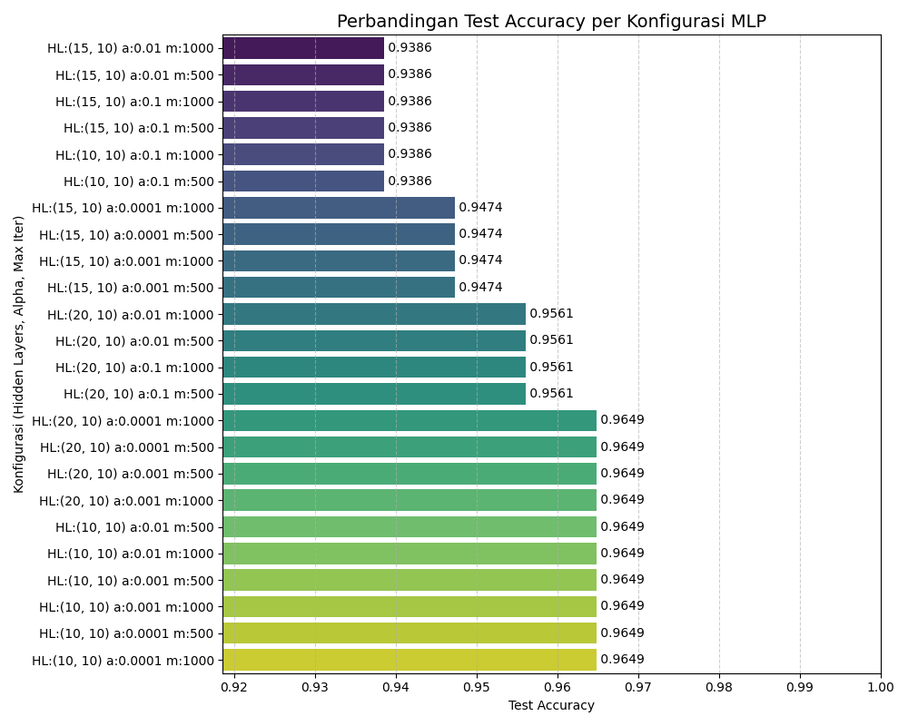
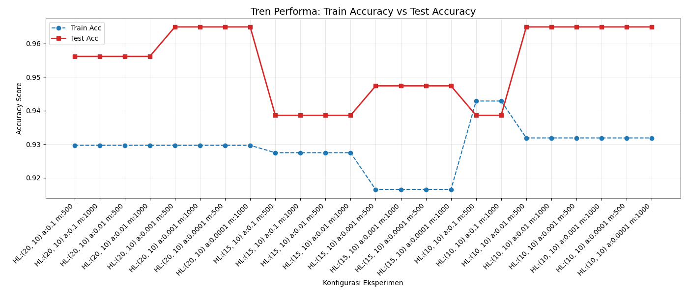

# Task 1 - Multi Layer Perceptron
Kelas Kecerdasan Komputasional dan Pembelajaran Mesin.

**Dataset**: Breast Cancer Wisconsin Diagnostic [(UCI ID:17)](https://archive.ics.uci.edu/dataset/17/breast+cancer+wisconsin+diagnostic)

**Arsitektur model**:
* Input layer terdiri dari 30 neuron, sesuai dengan jumlah fitur.
* Ada 2 hidden layer yang digunakan dengan jumlah neuron di hidden layer kedua 10 neuron, sedangkan hidden layer pertama akan beragam jumlahnya.
* Activation Function yang dipakai adalah ReLu (Rectified Linear Unit).
* Optimizer: Adam (Adaptive Moment Estimation) untuk pembaruan bobot yang efisien.

**Hasil eksperimen**:

